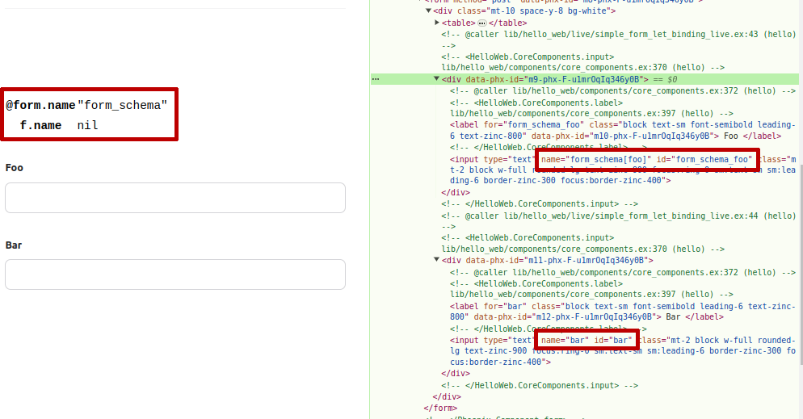

# Hello

Minimal example to reproduce a seemingly misbehaving `:let` binding in phoenix
html form when using a `simple_form` component as it is generated with the `mix
phx.new` task.

Basically, a let binding defined like this:

```
    <.simple_form :let={f} for={@form}>
      <.input field={f[:foo]} label="Foo" />
    </.simple_form>
```

Will cause `f` to refer to a form struct that has the name set to `nil`, which
in turn messes up the field names and submitted value groupings when compared
to using the form assign directly.

The example code lives in `lib/hello_web/live/simple_form_let_binding_live.ex`
and produces the following visible result:



To start your Phoenix server:

  * Run `mix setup` to install and setup dependencies
  * Start Phoenix endpoint with `mix phx.server` or inside IEx with `iex -S mix phx.server`

Now you can visit [`localhost:4000`](http://localhost:4000) from your browser.
